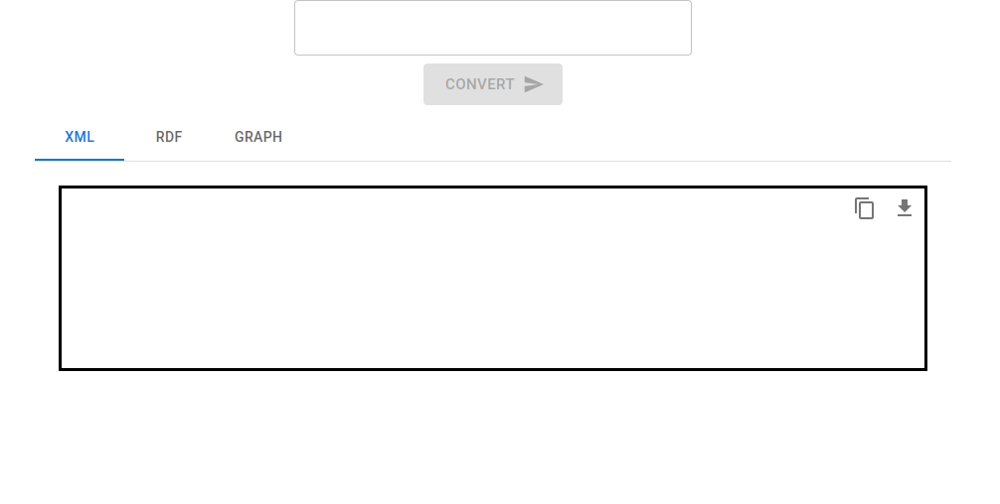
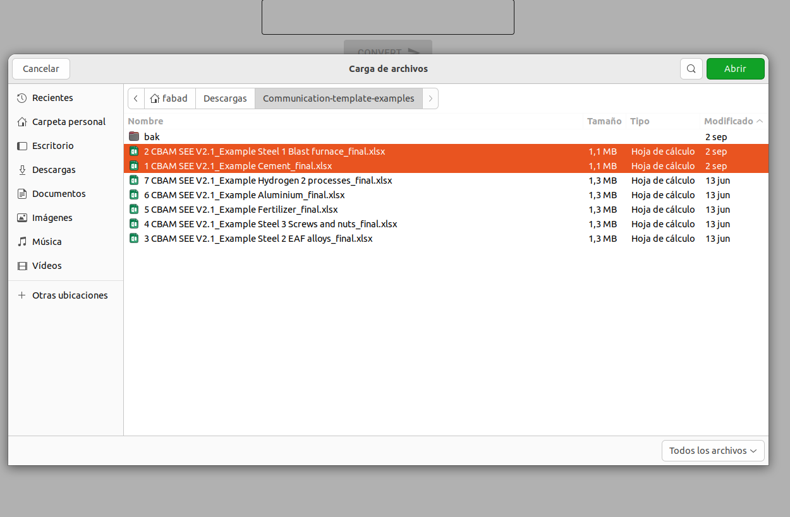
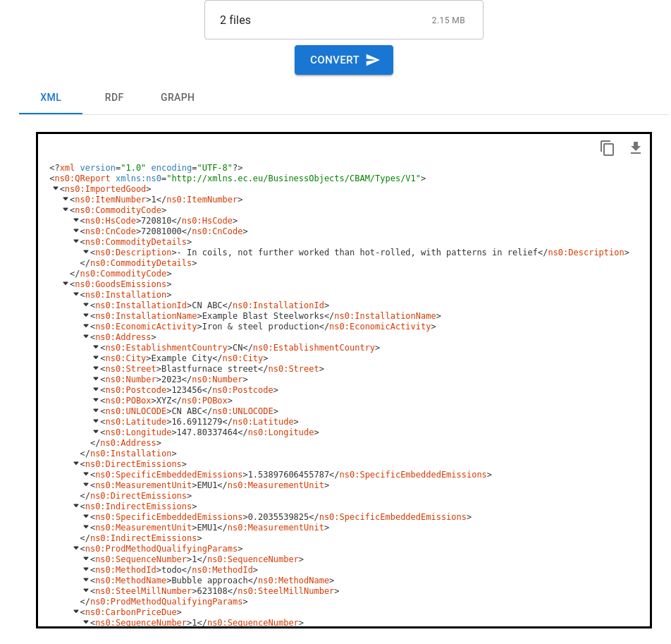
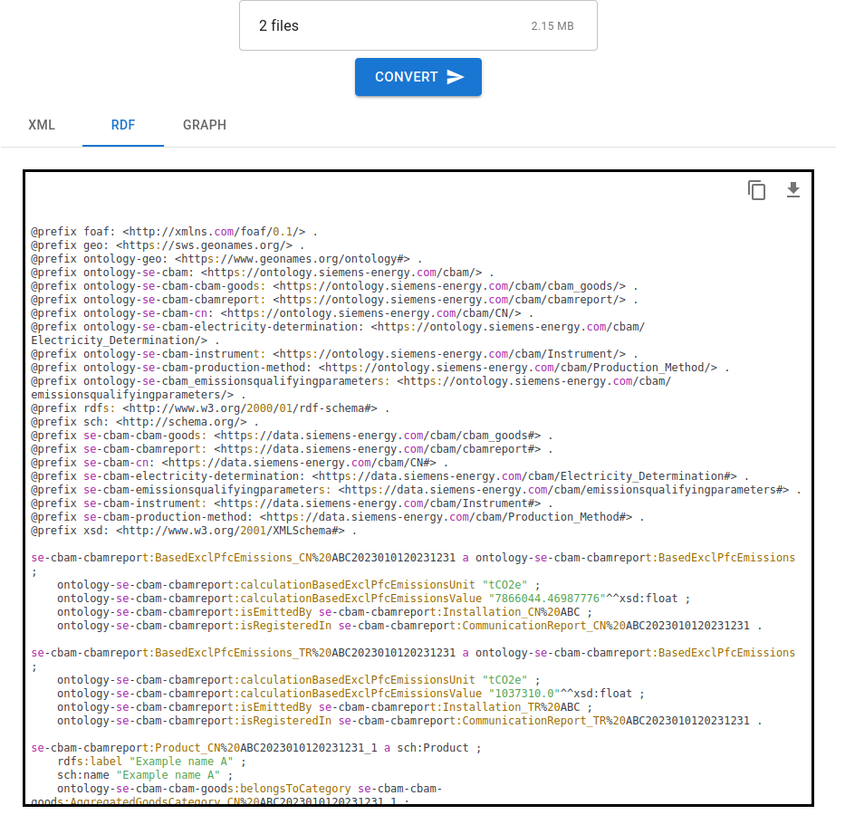
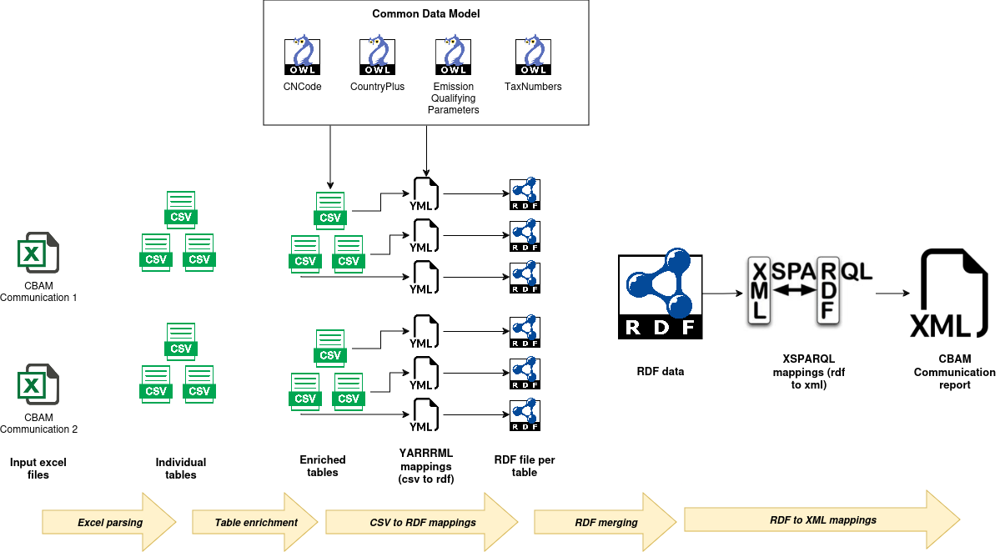

# Carbon Comply Web Application.

## User Interface

Carbon Comply is a web tool for generating a CBAM XML report from a set of CBAM Communication Excel files. The main window is the following:

CBAM Communication Excel reports can be loaded in the application by selecting them after clicking in the box at the top:

After selecting the input CBAM Communications, the "CONVERT" button will become enabled. When this button is clicked, the selected excel files are processed to generate a CBAM XML report, which is visible in the web application. This XML cannot be modified in the application, but it can be copied to the clipboard or downloaded by using the buttons on the top-right of the XML content:

Additionally, an RDF version of the data is also visible in turtle format by clicking the corresponding button:

## Architecture and installation
The application is composed by a REST endpoint written in Python Flask, acting as backend; and a web application, written in react, that consumes the REST endpoint.

The application has been dockerized, so it can be deployed by typing `docker-compose up` in a terminal in the same folder of the application. After that, the application will be available at [http://localhost:80](http://localhost:80).

The application can be configured through the `.env` file, which contains the following parameters:

  * **CC_REST_PORT**: The port in which the Backend REST endpoint will be listening.
  * **DATA_FOLDER**: The folder inside the docker container in which the intermediate files are generated.
  * **CC_UI_PORT**: The port to access the user interface in a web browser.
  * **SERVER_NAME**: The server in which the application is being deployed.

## Methods
The application recives a set of CBAM Communication Excel files as input, and returns a CBAM XML report as output by processing the input files. The method is described in the following figure:

In summary, the process consist on the following steps:

  1. **Excel parsing**: Each input excel is parsed to extract plain tables in CSV format, which is more suitable for processing.
  2. **Table enrichment**: The extracted tables are enriched with new columns in order to facilitate the next steps; for example, by generating a report identifier for linking the data to that identifier, or by including IRIs extracted from the controlled vocabulary given by ontologies describing the data elemens, such as countries or CN codes.
  3. **CSV to RDF mappings**: The enriched tables are mapped to RDF through the [YARRRML](https://rml.io/yarrrml/) mapping language. Each table has its own yarrrml mapping file so that each one is processed individually, generating an RDF file for each input CSV table. The mappings also make use of controlled vocabularies provided by ontologies to enrich the final RDF created; for example, by extracting differents formats for the CN codes, information of the emission parameters, or country codes. The engine used for applying the YARRRML mappings is provided by [morphkgc](https://morph-kgc.readthedocs.io/en/stable/).
  4. **RDF merging**: The individual RDF files are merged into a single one.
  5. **RDF to XML mappings**: The RDF data is used for building the final CBAM XML report. Particularly, the [XSPARQL](https://www.w3.org/submissions/xsparql-language-specification/) query language is used for mapping RDF to XML. The engine for executing the XSPARQL mappings is provided by a java command line tool available at [GitHub](https://github.com/semantalytics/xsparql).